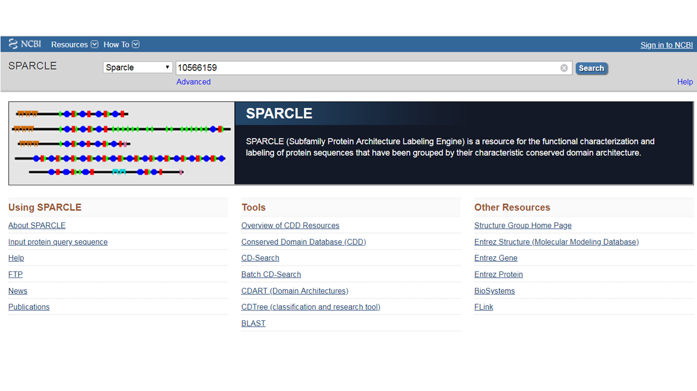
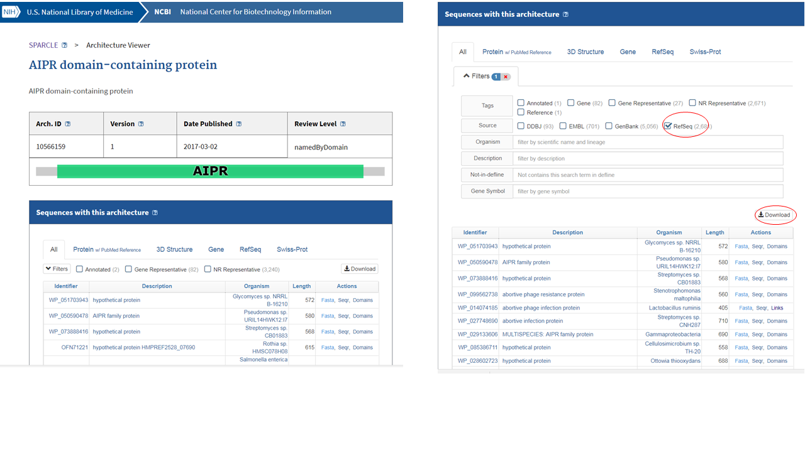
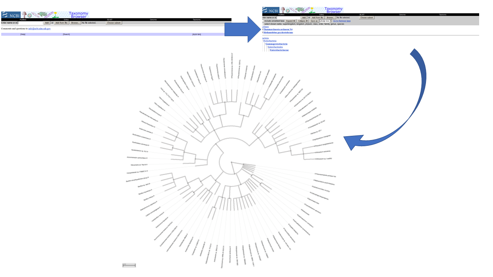

### Dependencies

```r
library(dplyr)
```

### Source some functions

```r
source("https://raw.githubusercontent.com/NCBI-Hackathons/typhoid_phages/master/R/CDname.R")
```


### Read csv file 
The data frame should have the following structure: 
  
  * Column1: protein accessions fromm phage1
  * Column2: phage1 accesion
  * Column3: protein accessions from phage1
  * Column4: phage 2 accesion


```r
dat <- read.csv("proteins.csv", header = FALSE)
```


### Clean query accession format (1st column) and create a new column

```r
dat <- dat %>% mutate(V1 = sub("\\..*", "", dat[[1]]))
dat <- dat %>% mutate(V1 = sub("\\", "", dat[[1]]))
```

### Extract shared proteins by two phages


```r
my_proteins <- unique(getProteins(dat))
```


### Get the Conserved Domains (if any) for each protein

```r
my_CD <- get_CDDacc(my_proteins)
```

The total number of CD is 3. We can see the distribution in the following table: 

```
## 
## pfam06528 pfam10592  PHA02536 
##         1         1         1
```
The proteins containing those CD are: YP_007003507.1, YP_007003508.1, YP_007003535.1

### Evolutionary Analysis
Now we can perform an evolutionary analysis by using the whole set of sequences (RefSeq database) with the same architecture as our proteins. 
For illustrative purposes, we'll show this example using the analysis only for pfam06528. The idea is running the same code for each domain of interest. 


#### Get the protein that contains that domain

```r
my_proteins[which(my_CD == "pfam10592")]
```

```
## [1] "YP_007003507.1"
```


```r
target <- my_proteins[which(my_CD == "pfam10592")]
my_links <- entrez_link(dbfrom = "protein", id = target	, db = "all")
target_cdd = entrez_summary(db = "cdd", id = my_links$links$protein_cdd)
```

**Accession**: pfam10592  
**Title**: AIPR  
**Abstract**: This family of proteins was identified in as an abortive infection phage resistance protein often found in restriction modification system operons.  


#### Get the sequences  with that architecture
Now from [SPARCLE](https://www.ncbi.nlm.nih.gov/sparcle) we can get the list of sequences with this architecture (AIPR). The id to search SPARCLE is:

```r
sparcle <- my_links$links$protein_sparcle
sparcle
```

```
## [1] "10566159"
```

You can go to SPARCLE and use that id as query



Then, you may want to filter by RefSeq sequences and download


#### Read downloaded file from SPARCLE

```r
my_archt <- read.csv("seqr.csv")
dim(my_archt)
```

```
## [1] 2681    4
```

```r
head(my_archt)
```

```
##           gi         acxn                           defline
## 1  917097231 WP_051703943              hypothetical protein
## 2  914438483 WP_050590478               AIPR family protein
## 3 1121675601 WP_073888416              hypothetical protein
## 4 1274375217 WP_099562738 abortive phage resistance protein
## 5  503840191 WP_014074185  abortive phage infection protein
## 6  654228060 WP_027748690        abortive infection protein
##   sequence_length
## 1             572
## 2             580
## 3             568
## 4             560
## 5             405
## 6             710
```

```r
hist(my_archt$sequence_length)
```

<!-- -->

#### E-Summary for each organism. 
This example shows the analysis for the first 100 organisms. 


```r
example = head(my_archt, 100)
seqs = lapply(example[[1]], function(x) entrez_summary(db = "protein", id = x))
```


```r
# Get the organism id
example <- example %>% mutate(Taxid = getTaxid(seqs))

# Export Taxids to csv file
write.csv(example[[5]], file = "./data/orgns_taxids", row.names = FALSE)
```


Next, go to [Taxonomy Common Tree](https://www.ncbi.nlm.nih.gov/Taxonomy/CommonTree/wwwcmt.cgi) under the Taxonomy NCBI database and add the ids by browsing your file. Then select "save as" phylip.tree.  
Go to  NCBI's [Tree Viewer](https://www.ncbi.nlm.nih.gov/projects/treeview/) and upload that file. You'll get the common tree for the organisms that encode for proteins with the same architecture than your target protein.   




